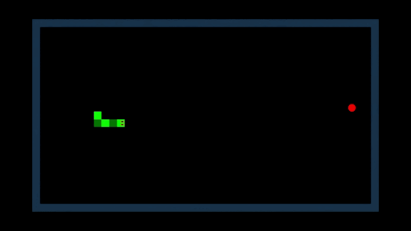

# Snake (2D)

Jogo Snake criado usando a engine Unity.

## 🐍🍎 Prévia da jogabilidade

  

> Snake é o nome comum para um conceito de videogame em que o jogador manobra uma linha que cresce em comprimento, com a própria linha sendo o principal obstáculo. O conceito se originou no jogo de arcade Blockade de 1976, e a facilidade de implementação do Snake levou a centenas de versões para muitas plataformas. Depois que uma variante foi pré-instalada nos telefones celulares da Nokia em 1998, houve um ressurgimento do interesse no conceito. [*Fonte*](https://en.wikipedia.org/wiki/Snake_(video_game_genre))

## 📋 Atalhos

- [Prefabs](Assets/Prefabs)
- [Scenes](Assets/Scenes)
- [Scripts](Assets/Scripts)
- [Sprites](Assets/Sprites)

## 🚀 Tecnologias

- Unity 2020.3.22f1 LTS

## 📚 Fontes

- [**unity-snake-tutorial**](https://github.com/zigurous/unity-snake-tutorial)